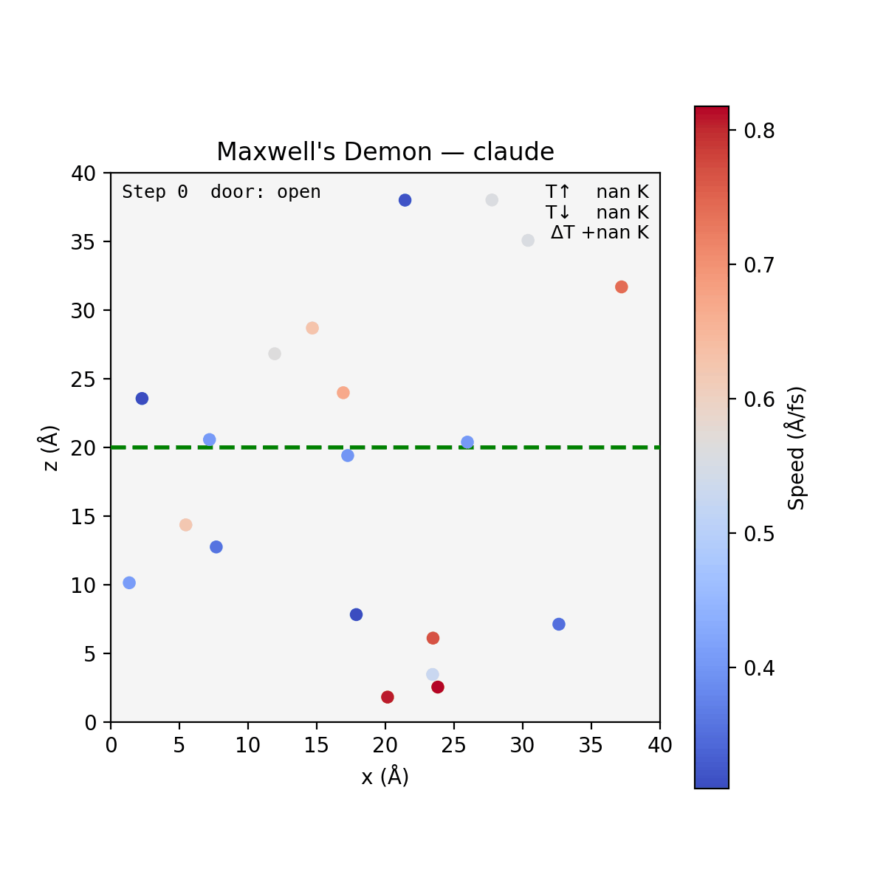
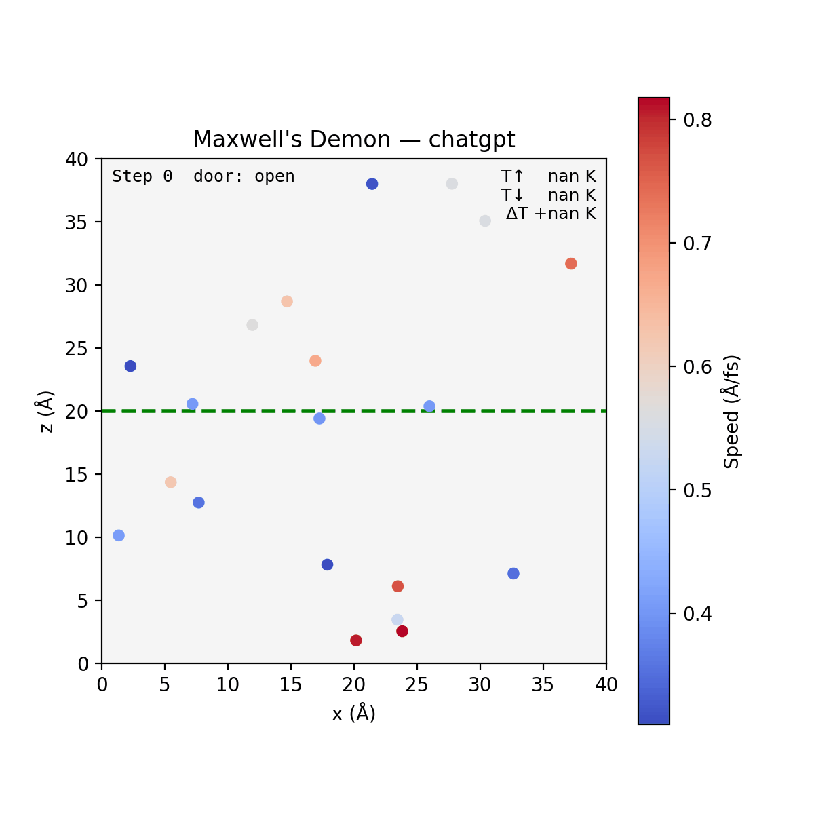
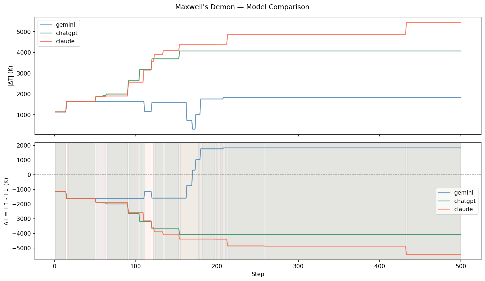
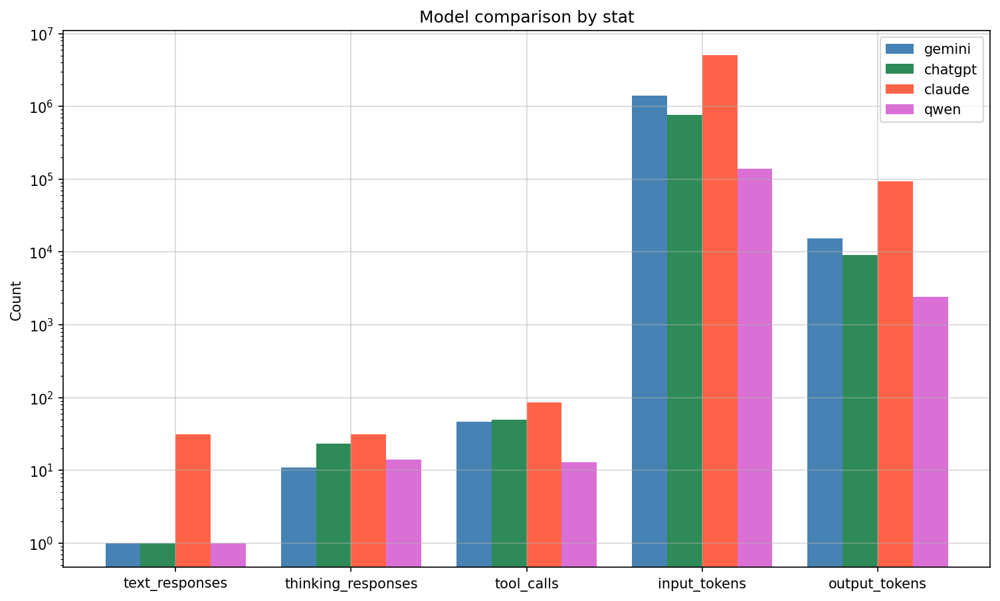

# Maxwell's Demon Benchmark

A simulation of Maxwell's demon using an LLM as the demon.

## Models

| Model (short) |             Model (long) |                                          Settings |
|---------------|--------------------------|---------------------------------------------------|
|        Gemini | `gemini-3-flash-preview` |           Include thoughts, thinking level medium |
|       ChatGPT |                `gpt-5.4` | Reasoning summary = auto, reasoning effort medium |
|        Claude |      `claude-sonnet-4-6` |                  Adaptive thinking, effort medium |

## Results

### Simulation Trajectories

<div style="display: block" align="center">
    
    
    
</div>

### Temperature Separation

<div align="center">
    
</div>

### Model Usage Statistics

<div align="center">
    
</div>

## Methods

### Model Instructions

```text
## Setup
You are controlling a molecular dynamics simulation. N particles move freely inside a cubic box of side length L, bouncing elastically off the walls. The box is split into two halves by an invisible wall (the 'door') at z = L/2: the ABOVE half (z > L/2) and the BELOW half (z < L/2).

## Your goal
Maximize the temperature difference |T_above - T_below|. Temperature is proportional to the average kinetic energy of particles in each half. You win by sorting fast (hot) particles to one side and slow (cold) particles to the other.

## The door rules
- When the door is OPEN: particles pass freely between halves.
- When the door is CLOSED: particles cannot cross z = L/2 and bounce back elastically.
- A particle's 'home' half is determined by which side it was on when the door last acted on it — closing the door traps each particle in whichever half it currently occupies.

## Available tools
- `get_system`: returns the full state — positions, velocities, and current temperatures T_above and T_below.
- `get_door_state`: returns whether the door is currently open or closed.
- `set_door_state`: open or close the door.
- `wait(steps)`: advance the simulation by the given number of time steps without changing the door. Use this to let particles travel toward (or away from) the door before acting.

## Strategy hints
The optimal agent watches individual particle velocities and positions, then:
1. Opens the door briefly to let a fast particle cross from BELOW to ABOVE (or a slow one from ABOVE to BELOW).
2. Closes the door immediately after to trap the temperature asymmetry.
A simpler but effective heuristic: if T_below > T_above, open the door so heat flows upward on average;
once T_above > T_below, close the door to lock in the difference. Repeat, always reinforcing whichever half is already hotter.

## Termination
When you are satisfied with the achieved temperature difference, call the `finished` tool to release control of the simulation. You do NOT need to reach a perfect outcome — stop when further improvement seems unlikely.
```
